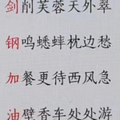

# 冰麒麟的博客

> 苟日新，日日新，又日新

一、我叫啥  
小弟姓吴名剑钢，字还没定。最新马甲：冰麒麟。
```
曾用马甲：吴江昂、子羽叔叔的剑（QQ空间名称）、商子羽、插兜顺拐斜刘海、插兜顺拐人字拖、惜时、修缘、望月居士、龙潭居士、吴钊、生椰拿不动铁、生椰拿伊芙、Lhooq（即蒙娜丽莎）、nice的、大熊（2007年QQ）
```
二、此博客之前身：  
2020年中开始QQ邮箱写，2020年11月15日开始QQ空间，2023年1月1日开始wordpress+阿里云托管网站，2026年8月8日开始docmd+github托管。  
```
2020年接手分团委后，我日记、笔记开始电子化、专题化，最初是用QQ邮箱写。2020年11月15日开始放到QQ空间写，2023年1月1日经过许久的筹备，迁移到wordpress+MySQL来做，并且开始用wujiangang.com这个网站域名。然而，相册、手机备忘录又逐渐替代了网站的记录功能，2024一周一变，不得闲抽出整个小时写文章，且写文容易发布繁琐，因此2024荒废也。 2025年忘记交网站费用，因此网站已经关闭，重新梳理太麻烦，因此我在微信公众号新开，更新70多篇文章,且笔记都notion上了。2026年上半年，我大多拍摄抖音记录画面感受，notion日记中记录感受，很少就某专题进行深思探索。 而2026年8月8日，用agent帮我整理文件夹时发现如此方便，于是回去翻出50GB的云服务器镜像，找回这些散佚的文章，希望能接续2021、2023的精神，继续向前。
```

三、历次开业之序言


（1）from大杭  
```
这辈子写过日记写过散文写过议论文写过小说甚至写过打油诗，但是剑钢兄弟让我作序的时候，我着实还是头脑空白了。毕竟作为一个粗人，书没看过几本，序就更不用说了。   

剑钢在我心目中是个怎样的人呢，这个网站对于剑钢、对于你我的意义如何呢？这是一个很难以言说的问题。  

生活在这个时代，我们的一切轨迹都可以得到记录，无论是被动的还是主动的，人们更加容易记下自己的存在和自己的观点。让我们在未来回望过去的时候，有更多的锚点可以停靠。这是一种悲哀还是一种幸运，想必应该还是庆幸居多。这也是我对这个网站最初的印象，也是希望它能成为的样子。一个独立的网站并没有价值，就像互联网的前身阿帕网一样。直到接入设备的增多，互联网体现了传播性和平台性，它才体现了它最大的价值。我会把这个网站比作虚拟人物，是一个人物镜像，记录了时间长河中的，那一个个具体时间点的你我。让我们在生活中留下印记。  

剑钢在我的印象中，一直是一个笃定的人，亦如这个网站给人们透露出来的气息，安稳、清晰、同时又充满观点。只言片语记录下的，不能称之为观点亦或是理论，它只是想法和灵感。但是正是这么多想法的集合，我们就可以将其称为理论或者是世界观了。而我相信，它最终就会成为这么一个世界观的集合。  

语塞，就毕。

2023年元旦  
作于杭城
```
（2）from竞宏

    在每个平凡的日子里采撷各色的标本，究其纹路，赏其道理，有感而发，悟得新意。拾柴聚火，指引自己前行的路，温暖旁人路过时的那一瞬间。愿大家一起做新民，苟日新日日新又日新。

（3）from扬帆



（4）from梓融
```
    2022年12月31日，这个日子可以被赋予很多意义：2022年的最后一天，新一年的前夕；杭州疫情彻底放开的第二十六天，我和剑钢患病后“阳康”；剑钢考研结束后的第六天，也许在不久的将来我们就会各奔东西。当然，以上都不是我今天写这些的目的。最重要的是，剑钢的个人小站即将开始营业啦！

    作为一个记录个人生活所思所想的地方，网站的内容有些多且繁杂，可以看出剑钢正在不断探索，尝试新的东西。相信剑钢在不断的记录与思考当中，能够再次发现自己热爱的东西！

    最后，希望剑钢能不断坚持更新，做大做强！（当然小富小贵就可以了，毕竟网站维护还是很烧钱的。）也希望各位看官们能找到其中的共鸣，多多支持剑钢~
```
(5)自序：
```
    2023.1.1开张，当然溯源起来2020年11月开始写博客，具体可以看看《一年几篇》系列的文章《[2020年11月15日凌晨，我决定把这里作为我的个人网站了](https://www.wujiangang.com/86.html)》，但是现在这个当然远远不会只是个博客而已了，具体的要用行动代替说话了，一言以蔽之的话，就是我的个人文字、音频、视频以及其他形式的功能性应用中，勉强称得上作品的集合地。

    理念：everyone should get a say in how technologies change our life 要想解放全人类，靠的是人人意识到要自己做主，并拥有相应的实力。

    搞这些有啥用？为当下计：网络裸奔时代，给自己穿上内衣，保护自己；为长久计：堵住嘴巴的年代，给自己留点自留地，尽一尽记录历史的责任；何必用网站：从《老子》一人之作为一本书，五千言，到《鲁迅全集》七百万字，再到如今一个人的创作已经不仅仅是文字一种形式，又何止上千万字？因此有一个自己之文字、声音图像视频之地，实在有必要。

    网站内容：
（1）记录我的文字、声音、图像、视频。
（2）保存和分享一些有价值的资源和资料（包括一些被禁的被墙的）

    目前主要的几个系列：
（1）读书心得——《非黄金屋》
（2）电影心得——《爆米花时间》
（3）游戏时光
（4）课程回顾

    正在开拓的系列：
（1）直播式学习
（2）开放投稿，如果你的pyq被封禁了，可以借助这个平台作为链接来源。

    未来总是难以预测，走着瞧叭！

——商子羽，2023.1.1
```


**网站文章共 191 篇**

内容来源：
- WordPress 站点 wujiangang.com（2022–2024年，230篇文章）
- 技术实践笔记 D:\OnlyAMess（2023年，40+篇技术教程）
- 个人精选文章 D:\我写的文章（影评、杂文、家史等）
- 创意作品 D:\创作（诗歌、剧本、AI科普）
